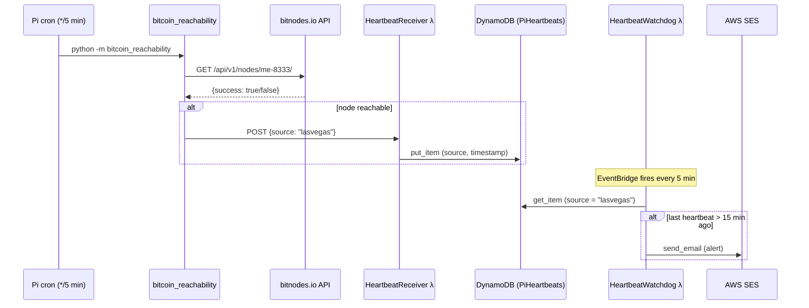

# bitcoin-node-watchdog

Monitors a Bitcoin full node running on a Raspberry Pi. Every five minutes a cron job checks whether the node is reachable from the internet via [bitnodes.io](https://bitnodes.io) and, if so, posts a heartbeat to AWS. A watchdog Lambda fires an SES email alert whenever heartbeats stop arriving — catching Pi crashes, network outages, and Bitcoin node failures alike.


---

## Requirements

| Component | Requirement |
|-----------|-------------|
| Hardware | Raspberry Pi 4, 8 GB RAM |
| OS | Debian GNU/Linux 13 (trixie), aarch64 |
| Python | ≥ 3.11 (uses `tomllib`) |
| AWS | Account with SES, Lambda, DynamoDB, EventBridge, CDK |
| Node.js | Required on the deploy machine for AWS CDK CLI |
| External | [bitnodes.io](https://bitnodes.io) API (public, no key needed) |

---

## Architecture



---

## Configuration

There are no secret values on the Pi. All settings live in `config.toml`.

**`config.toml`** — committed to the repo, contains only non-sensitive settings:

```toml
[bitcoin.reachability]
service_endpoint   = "https://bitnodes.io/api/v1/nodes/me-8333/"
heartbeat_endpoint = "https://<id>.lambda-url.eu-central-1.on.aws/"
```

Set `heartbeat_endpoint` to the `HeartbeatReceiverUrl` output from the CDK stack after deployment.

**AWS secrets** — stored as GitHub Actions secrets, never in the repo:

| Secret | Where to set | Value |
|--------|-------------|-------|
| `AWS_ACCOUNT_ID` | Repo → Settings → Secrets | Your 12-digit AWS account ID |

Alert addresses (`ALERT_TO`, `ALERT_FROM`) and the silence threshold (`THRESHOLD_MINUTES=15`) are defined in the CDK stack (`aws/stacks/bitcoin_monitor_stack.py`) and deployed as Lambda environment variables.

---

## Install & run

```bash
# On the Raspberry Pi
git clone https://github.com/janrothen/bitcoin-node-watchdog.git
cd bitcoin-node-watchdog
python -m venv .venv
source .venv/bin/activate
pip install -e .

# Edit config.toml — set heartbeat_endpoint (see Deployment below)

# Run once manually to verify
python -m bitcoin_reachability
```

---

## Development

```bash
# Install with dev dependencies
pip install -e ".[dev]"

# Run tests
pytest

# Run without a live Pi or real AWS endpoint
# Point heartbeat_endpoint at a local mock (e.g. httpbin or a simple Flask stub)
# and set service_endpoint to any URL returning {"success": true}
```

No state is written locally; all persistence is in DynamoDB.

---

## Deployment

### Pi — cron schedule

Add to crontab (`crontab -e`):

```
*/5 * * * * /home/pi/bitcoin-node-watchdog/.venv/bin/python -m bitcoin_reachability >> /home/pi/bitcoin-node-watchdog/watchdog.log 2>&1
```

### AWS — CDK (one-time setup)

**1. Bootstrap CDK** (once per account/region):

```bash
cd aws
pip install -r requirements.txt
npm install -g aws-cdk
cdk bootstrap aws://ACCOUNT_ID/eu-central-1
```

**2. Configure GitHub OIDC** so Actions can deploy without stored credentials:

- AWS Console → IAM → Identity Providers → Add provider
  - Type: OpenID Connect
  - URL: `https://token.actions.githubusercontent.com`
  - Audience: `sts.amazonaws.com`
- Create IAM Role `GitHubActionsDeployRole` with this trust policy:
  ```json
  {
    "Effect": "Allow",
    "Principal": { "Federated": "arn:aws:iam::ACCOUNT_ID:oidc-provider/token.actions.githubusercontent.com" },
    "Action": "sts:AssumeRoleWithWebIdentity",
    "Condition": {
      "StringEquals": {
        "token.actions.githubusercontent.com:aud": "sts.amazonaws.com",
        "token.actions.githubusercontent.com:sub": "repo:janrothen/bitcoin-node-watchdog:ref:refs/heads/main"
      }
    }
  }
  ```
- Attach permissions for: CloudFormation, Lambda, DynamoDB, SES, IAM, EventBridge

**3. Verify SES sender** in eu-central-1:

- AWS Console → SES → Verified identities → verify `home.lasvegas.fullnode@gmail.com`

**4. Add GitHub secret:**

- Repo Settings → Secrets and variables → Actions → New secret
- Name: `AWS_ACCOUNT_ID`, value: your 12-digit account ID

**5. Deploy:**

Push any change to `aws/**` on `main` — GitHub Actions runs `cdk deploy` automatically.

Or deploy manually:

```bash
cd aws
cdk deploy
```

**6. Update `config.toml`** on the Pi with the `HeartbeatReceiverUrl` from the stack outputs.

---

## Troubleshooting

| Symptom | Likely cause |
|---------|-------------|
| `Node is not reachable from outside.` logged every run | Bitcoin node is down, port 8333 is blocked, or the Pi's public IP changed |
| `Failed to send heartbeat: ...` | `heartbeat_endpoint` in `config.toml` is wrong or Lambda URL is invalid |
| No alert email after node goes down | SES sender address not verified, or `ALERT_TO`/`ALERT_FROM` mismatch in CDK stack |
| Alert fires even when node is up | Pi clock drifted; run `sudo chronyc makestep` to resync |
| `FileNotFoundError: config.toml` | Script is not run from the repo root, or `config.toml` is missing |
| CDK deploy fails with `ExpiredTokenException` | GitHub OIDC role or `AWS_ACCOUNT_ID` secret is misconfigured |

---

## State file

There is no local state file on the Pi. The only persistent state is the `PiHeartbeats` DynamoDB table (one item per monitored node, keyed by `source`). On first run the receiver Lambda creates the item. The watchdog will alert if no record exists at all, so a fresh deployment with no heartbeat yet will trigger one alert on the first watchdog invocation — this is expected and resolves itself within the next cron cycle.

---

## Security

- **Never commit** `AWS_ACCOUNT_ID` or any AWS credentials to the repo. Use GitHub Actions secrets.
- The Lambda receiver URL has no authentication (`FunctionUrlAuthType.NONE`). Anyone who knows the URL can post a heartbeat. If this is a concern, rotate the URL by redeploying the stack.
- SES email addresses are stored as Lambda environment variables (visible in the AWS Console). Do not use personally sensitive addresses if the AWS account is shared.
- `config.toml` contains no secrets and is safe to commit.

---

## Contributing

Found a bug or have an idea? Open an issue or send a PR. Run `pytest` before submitting and keep changes focused.

---

## License

MIT © Jan Rothen — see [LICENSE](LICENSE) for details.
