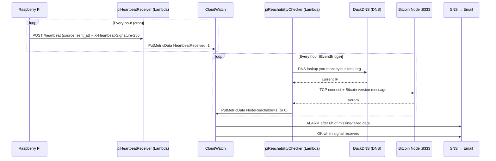

# Bitcoin Node Watchdog


[](https://github.com/janrothen/bitcoin-node-watchdog/actions/workflows/deploy-aws.yml)

[](https://sonarcloud.io/project/overview?id=janrothen_bitcoin-node-watchdog)
[](https://sonarcloud.io/project/overview?id=janrothen_bitcoin-node-watchdog)
[](https://sonarcloud.io/project/overview?id=janrothen_bitcoin-node-watchdog)
[](https://sonarcloud.io/project/overview?id=janrothen_bitcoin-node-watchdog)
[](https://www.gitguardian.com)

Monitors a Bitcoin full node running on a Raspberry Pi. A Python package on the Pi sends an hourly heartbeat to AWS. A Lambda on AWS independently checks whether the node is reachable from the internet every hour by performing a real Bitcoin P2P handshake (resolving the current IP via DuckDNS, then exchanging `version`/`verack` messages on port 8333). CloudWatch Alarms watch both signals and send a single email via SNS when either has been missing for 6 hours — and another when it recovers.

## Requirements

**Hardware**
- Raspberry Pi 4, 8 GB RAM
- Bitcoin full node reachable on port 8333 from the internet
- Dynamic DNS via [DuckDNS](https://www.duckdns.org) keeping your public IP up to date

**Software**
- OS: Debian GNU/Linux 13 (trixie), aarch64
- Python 3.13
- AWS account with CDK bootstrap completed in `eu-north-1`

**External dependencies**
- [DuckDNS](https://www.duckdns.org) — provides a stable hostname for your dynamic IP
- AWS Lambda, DynamoDB, CloudWatch, SNS, EventBridge (all managed by the CDK stack)

## Architecture



## Configuration

The Pi reads `config.toml` at runtime. There are no secrets in this file — it only contains URLs.

```toml
[heartbeat.receiver]
endpoint = "https://<id>.lambda-url.eu-north-1.on.aws/"
```

`heartbeat.receiver.endpoint` comes from the `HeartbeatReceiverUrl` CloudFormation stack output after deploying. Settings like Bitcoin port and alarm thresholds live in the CDK stack (`aws/stacks/bitcoin_monitor_stack.py`). `alert_email`, `node_id`, `heartbeat_secret`, and `ip_provider_hostname` are passed as CDK context values at deploy time (see [Deployment](#deployment)).

## Credentials (`.env`)

Copy `.env.example` to `.env` and fill in your credentials:

```bash
cp .env.example .env
```

```dotenv
HEARTBEAT_SECRET=your-shared-secret
NODE_ID=your-bitcoin-fullnode-id
```

`HEARTBEAT_SECRET` — shared secret used to sign heartbeats. Generate one with:
```bash
python3 -c "import secrets; print(secrets.token_hex(32))"
```

`NODE_ID` — identifier for this node, used as the CloudWatch dimension and heartbeat source. Must match the value configured in the CDK stack (`NODE_ID` constant in `aws/stacks/bitcoin_monitor_stack.py`).

## Install & run

```bash
cd ~/bitcoin-node-watchdog
python3 -m venv .venv
source .venv/bin/activate
pip install .
```

Run once manually:
```bash
.venv/bin/python -m heartbeat_sender
```

## Development

```bash
python3 -m venv .venv
source .venv/bin/activate
pip install -e ".[dev]"
pytest
```

The Pi package has no dependency on AWS at runtime beyond the heartbeat HTTP POST — you can test it locally by pointing `heartbeat.receiver.endpoint` at any tool that accepts POST and returns 200 (e.g. [httpbin.org](https://httpbin.org/post) or a local mock server).

### Smoke testing the live endpoint

After deploying, verify the Lambda endpoint rejects unauthenticated requests and accepts valid ones:

```bash
HEARTBEAT_SECRET=<your-secret> python scripts/smoke_test.py
```

Expected output:
```
[PASS] No auth → 401
[PASS] Valid signature → 200
```

Requires only `requests` (installed with `pip install .`) and reads the endpoint from `config.toml`.

The Lambda functions use only Python standard library + `boto3` (built into the Lambda runtime), so they can be unit-tested without deployment.

### Testing the full pipeline manually

Force the `HeartbeatMissing` alarm into ALARM state to verify an alert email arrives:

```bash
bash scripts/test_alarm.sh
```

Then reset it back to OK to verify the recovery email:

```bash
bash scripts/test_recovery.sh
```

Requires AWS CLI configured with credentials that have `cloudwatch:SetAlarmState` permission.

## Deployment

### First-deploy checklist

- [ ] Bootstrap CDK (once per account/region)
- [ ] Configure GitHub OIDC and create `GitHubActionsDeployRole`
- [ ] Add `AWS_ACCOUNT_ID`, `HEARTBEAT_SECRET`, `NODE_ID`, and `ALERT_EMAIL` GitHub secrets
- [ ] Push to `main` → GitHub Actions runs `cdk deploy`
- [ ] Confirm SNS subscription email
- [ ] Update `config.toml` on the Pi with `HeartbeatReceiverUrl`
- [ ] Run `HEARTBEAT_SECRET=<secret> python scripts/smoke_test.py` — both lines should show `PASS`

### Pi — cron job

See [deploy/cron/README.md](deploy/cron/README.md) for installation steps.

### Pi — log rotation

The cron job appends to `/var/log/bitcoin-node-watchdog-cron.log`. To prevent
unbounded growth, install the logrotate drop-in — see
[deploy/logrotate.d/README.md](deploy/logrotate.d/README.md) for installation steps.

### AWS — one-time setup

**1. Bootstrap CDK** (once per account/region):
```bash
cd aws
pip install -r requirements.txt
npm install -g aws-cdk
cdk bootstrap aws://YOUR_ACCOUNT_ID/eu-north-1
```

**2. Configure GitHub OIDC** so GitHub Actions can deploy without stored credentials:
- AWS Console → IAM → Identity Providers → Add provider
  - Type: OpenID Connect
  - URL: `https://token.actions.githubusercontent.com`
  - Audience: `sts.amazonaws.com`
- Create IAM Role `GitHubActionsDeployRole` with trust policy:
  ```json
  {
    "Effect": "Allow",
    "Principal": {
      "Federated": "arn:aws:iam::ACCOUNT_ID:oidc-provider/token.actions.githubusercontent.com"
    },
    "Action": "sts:AssumeRoleWithWebIdentity",
    "Condition": {
      "StringEquals": {
        "token.actions.githubusercontent.com:aud": "sts.amazonaws.com",
        "token.actions.githubusercontent.com:sub": "repo:janrothen/bitcoin-node-watchdog:ref:refs/heads/main"
      }
    }
  }
  ```
- Attach permissions: `AWSCloudFormationFullAccess`, `AWSLambda_FullAccess`, `AmazonSNSFullAccess`, `CloudWatchFullAccess`, `AmazonEventBridgeFullAccess`, `IAMFullAccess`

**3. Add GitHub secrets:**
- Repo Settings → Secrets and variables → Actions → New secret
- Name: `AWS_ACCOUNT_ID`, value: your 12-digit AWS account ID
- Name: `HEARTBEAT_SECRET`, value: same secret as your Pi's `.env` file
- Name: `NODE_ID`, value: same node ID as your Pi's `.env` file (e.g. `lasvegas`)
- Name: `ALERT_EMAIL`, value: email address to receive alarm and recovery notifications
- Name: `IP_PROVIDER_HOSTNAME`, value: hostname that resolves to your node's public IP (e.g. `you-monkey.duckdns.org`)

**4. Deploy:**

Push any change under `aws/` to `main` — GitHub Actions runs `cdk deploy` automatically.

Or deploy manually:
```bash
cd aws
cdk deploy --context heartbeat_secret=<your-secret> --context node_id=<your-node-id> --context alert_email=<your-email> --context ip_provider_hostname=<your-hostname>
```

**5. Confirm SNS email subscription:**

After the first deploy, AWS sends a confirmation email to the address configured in the CDK stack. Click the confirmation link — no alerts will be delivered until this is done.

**6. Update `config.toml`** on the Pi with the `HeartbeatReceiverUrl` from the CloudFormation stack outputs.

**7. Verify the endpoint:**
```bash
HEARTBEAT_SECRET=<your-secret> python scripts/smoke_test.py
```
Expected: `[PASS] No auth → 401` and `[PASS] Valid signature → 200`.

### AWS resources created

All resources live in the `BitcoinMonitorStack` CloudFormation stack (visible in AWS Console → CloudFormation → eu-north-1):

| Resource | Purpose |
|---|---|
| `piHeartbeatReceiver` Lambda | Receives POST from Pi, emits CloudWatch metric |
| `piReachabilityChecker` Lambda | Hourly Bitcoin P2P handshake check via DuckDNS, emits CloudWatch metric |
| `BitcoinNodeAlerts` SNS topic | Delivers alarm and recovery emails |
| `BitcoinNode-HeartbeatMissing` CloudWatch alarm | Fires after 6h of missing heartbeats |
| `BitcoinNode-NotReachable` CloudWatch alarm | Fires after 6h of failed reachability checks |
| EventBridge rule | Triggers reachability checker every hour |

## Troubleshooting

| Symptom | Likely cause |
|---|---|
| No alert email ever arrives | SNS subscription not confirmed — check inbox for the confirmation link |
| Alert fires but node is actually fine | bitnodes handshake timing out due to slow node startup; wait for full sync |
| `cdk deploy` fails with auth error | OIDC role misconfigured or `AWS_ACCOUNT_ID` secret wrong — re-check IAM trust policy |
| `python -m heartbeat_sender` exits silently | `heartbeat.receiver.endpoint` in `config.toml` not set — update with CloudFormation output URL |
| Heartbeat sender gets 401 | `HEARTBEAT_SECRET` on the Pi doesn't match the secret used during `cdk deploy` — re-check both and redeploy if needed |
| Cron job not running | Wrong Python path — use absolute path: `/home/pi/bitcoin-node-watchdog/.venv/bin/python` |
| CloudWatch alarms stuck in INSUFFICIENT_DATA | No data yet — wait up to 1h for the first Lambda invocations |
| Alarm fires every hour instead of once | OK action not set on alarm — redeploy the CDK stack |
| DuckDNS lookup returns stale IP | DDNS update cron (`bitcoin-node-watchdog`) not running on Pi — check that cron job |
| `/var/log/bitcoin-node-watchdog-cron.log` growing without bound | logrotate drop-in not installed — see [deploy/logrotate.d/README.md](deploy/logrotate.d/README.md) |

## Security

- `config.toml` contains no secrets — it is safe to commit
- Requests are authenticated with HMAC-SHA256: the sender computes `HMAC(secret, raw request body)` and sends the hex digest as `X-Heartbeat-Signature-256` — the secret is never transmitted in plaintext and every body field is authenticated. Each signature is single-use, bound to the timestamp inside the body, and the receiver rejects requests older than 90 seconds
- Never commit AWS credentials — the deployment uses OIDC (no stored keys)
- The `AWS_ACCOUNT_ID` GitHub secret is a 12-digit number, not a credential, but keep it private

## Contributing

Found a bug or have an idea? Open an issue or send a PR. Run `pytest` before submitting and keep changes focused.

## License

MIT © Jan Rothen — see [LICENSE](LICENSE) for details.
